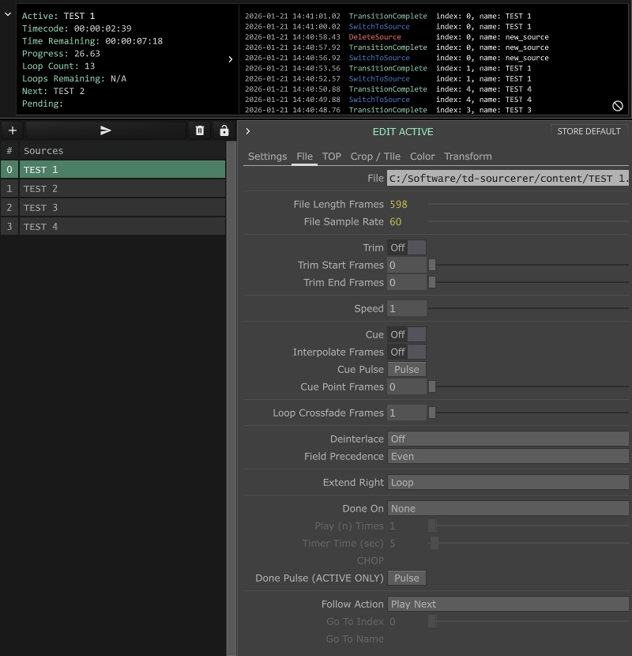
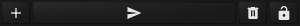
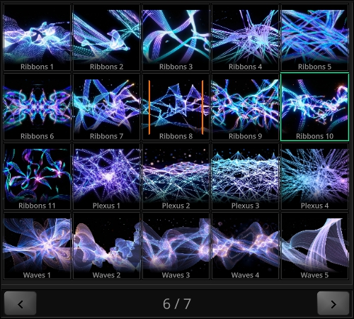

# Sourcerer

**TouchDesigner version 2025.32280**

License: MIT

[Matthew Wachter](https://www.matthewwachter.com) | [VT Pro Design](https://www.vtprodesign.com)

## Overview

Sourcerer is a streamlined media management component for TouchDesigner that provides organized playback, processing, and switching of image files and generative sources.



## Features

- Centralized source management with a list-based interface
- Support for file-based media and TOP-based generative content
- Built-in transitions with customizable timing and easing (Dissolve, Dip, Slide, Wipe, Blur, File, TOP)
- Post-processing effects (crop, tile, color correction, transform)
- Follow actions for automated playback sequences with early transition triggering
- Transition queue system with optional bypass and state machine management
- Real-time display properties (timecode, progress, loop count, time remaining, next source)
- Callback system for integration with external logic
- Import/export functionality for source presets
- Safety mode for preventing accidental destructive actions
- Internal logging with optional external Logger integration
- Dependable properties for reactive UI updates

## Usage

### Managing Sources

Sources can be created, arranged, and triggered using the toolbar buttons above the source list. New sources can also be created by dropping files or TOPs directly into the list.

**Toolbar buttons:**



- **Add** - Add new source
- **TAKE** - Take selected source
- **Delete** - Delete selected source
- **Lock** - Lock/unlock editing (prevents accidental changes)

Sources can be reordered by dragging within the list.

**Right-click context menu:**
- Take - Take the selected source
- Copy / Paste - Copy and paste source configurations
- Delete - Remove the selected source
- Import - Import sources from JSON file
- Export Selected - Export selected source to JSON
- Export All - Export all sources to JSON

### Editing Sources

Select a source in the list to view and edit its parameters in the parameter panel. Changes are applied immediately. When editing the currently active (live) source, changes are reflected in real-time.

Use **Save as Default** to store the selected source's settings as the template for newly created sources.

### Extension Methods

Switch to sources programmatically using the `Take()` method:

```python
# By index
op('Sourcerer').Take(1)

# By name
op('Sourcerer').Take('Blackout')

# Force switch (clears queue, ignores pending queue setting)
op('Sourcerer').Take('Emergency', force=True)
```

### Creating Sources Programmatically

Use `GetDefaultSource()` to get a source template, modify it, then pass it to `AddSource()`:

```python
# Get a template with default values
source = op('Sourcerer').GetDefaultSource()

# Customize the source settings
source['Settings']['Name'] = 'My Video'
source['Settings']['Sourcetype'] = 'file'
source['Settings']['Transitiontype'] = 'blur'
source['Settings']['Transitiontime'] = 1.5

# Set file-specific parameters
source['File']['File'] = '/path/to/video.mp4'
source['File']['Speed'] = 1.0

# Add the source to the list
op('Sourcerer').AddSource(source_data=source)
```

For simpler cases, use the shorthand parameters:

```python
# Add a file source
op('Sourcerer').AddSource(source_type='file', source_path='/path/to/video.mp4', source_name='My Video')

# Add a TOP source
op('Sourcerer').AddSource(source_type='top', source_path='/project1/myTOP', source_name='Generator')
```

### Temporary Sources

Switch to a source that doesn't exist in the source list by passing a source data dict directly to `Take()`. This is useful for emergency overrides, one-off content, or dynamically generated sources:

```python
# Create a temporary source
source = op('Sourcerer').GetDefaultSource()
source['Settings']['Name'] = 'Emergency Override'
source['Settings']['Transitiontype'] = 'dissolve'
source['Settings']['Transitiontime'] = 0.25
source['File']['File'] = '/path/to/emergency.mp4'

# Switch to it (clears queue, switches immediately)
op('Sourcerer').Take(source)
```

**Temporary source behavior:**
- `ActiveSource['index']` is set to -1 (not in the source list)
- `ActiveSource['name']` is set to the source's Name field
- Respects pending queue like normal sources (use `force=True` to bypass)
- Follow actions are not supported (no index to reference)
- The source is not added to the list

You can also copy an existing source and modify it:

```python
# Copy source at index 0 and modify it
source = op('Sourcerer').CopySourceData(0)
source['Settings']['Name'] = 'Modified Copy'
source['File']['Speed'] = 2.0  # Double speed
op('Sourcerer').Take(source)
```

### Pending Queue

When a transition is in progress and a new source switch is requested, the request is added to a pending queue. This ensures transitions complete smoothly without interruption.

**Queue behavior:**
- **Enable Pending Queue ON**: New requests are queued and processed after the current transition completes
- **Enable Pending Queue OFF**: New requests start immediately, interrupting the current transition

The queue can be managed programmatically:

```python
# Clear all pending switches
op('Sourcerer').ClearPendingQueue()

# Skip to the last queued item (useful for rapid navigation)
op('Sourcerer').SkipToLastPending()

# Check queue status
queue = op('Sourcerer').PendingQueue  # List of pending sources
is_transitioning = op('Sourcerer').isTransitioning  # Boolean
is_queue_enabled = op('Sourcerer').isQueueEnabled  # Boolean
```

### Display Properties

Active sources expose real-time display properties that can be bound to UI elements:

| Property | Description |
|----------|-------------|
| `Timecode` | Current playback position (HH:MM:SS:FF) |
| `TimeRemaining` | Time until source completes (varies by done condition) |
| `Progress` | Playback progress (0-100%, varies by done condition) |
| `LoopCount` | Number of completed loops (file sources only) |
| `LoopsRemaining` | Loops remaining in play_n_times mode |
| `Next` | Name of the next source based on follow action |

**Display behavior by source type and done condition:**

| Source Type | Done Condition | Progress/TimeRemaining Based On |
|-------------|----------------|--------------------------------|
| File | play_n_times | Total progress across all loops |
| File | timer | Timer progress |
| File | none/manual | Single-loop file progress |
| TOP | timer | Timer progress |
| TOP | none/manual | N/A |

Access via the active source component:
```python
op('Sourcerer').ActiveSourceComp.Timecode
op('Sourcerer').ActiveSourceComp.Progress
op('Sourcerer').ActiveSourceComp.TimeRemaining
op('Sourcerer').ActiveSourceComp.Next
```

Display updates can be disabled for performance via **Update Display** in the Settings page.

## Transitions

Each source defines the transition used when switching **to** that source. The transition system uses a GLSL shader located at [scripts/transitions.glsl](scripts/transitions.glsl).

### Transition Types

| Type | Description |
|------|-------------|
| **Dissolve** | Crossfade between sources |
| **Dip** | Fade to a color, then fade to the incoming source |
| **Slide** | Push content in a specified direction (left, right, up, down) |
| **Wipe** | Hard-edge reveal in a specified direction |
| **Blur** | Crossfade with blur peaking at midpoint (13-tap Gaussian kernel) |
| **File** | Luma matte transition from a file (black to white gradient) |
| **TOP** | Luma matte transition from a TOP operator |

**Transition-specific parameters:**

| Transition | Parameter | Description |
|------------|-----------|-------------|
| Dip | Dip Color | Color to fade through |
| Slide/Wipe | Transition Direction | Direction of movement (left, right, up, down) |
| Blur | Blur Amount | Maximum blur radius multiplier (default: 8.0) |
| File | Transition File | Path to luma matte image |
| TOP | Transition TOP | Path to TOP operator providing luma matte |

### Transition Timing

Set transition duration using the **Transition Time** parameter (in seconds). Enable **Use Global Transition Time** to use the global setting from Sourcerer's Settings page instead.

### Transition Shape

The **Transition Progress Shape** parameter controls the easing curve:

| Shape | Description |
|-------|-------------|
| Linear | Constant rate |
| Ease In | Accelerates into transition |
| Ease Out | Decelerates out of transition |
| Half Cosine (soft/hard) | S-curve with configurable steepness |
| Logistic (soft/hard) | Sigmoid curve with configurable steepness |
| Arctangent (soft/hard) | Atan-based curve with configurable steepness |
| Custom | User-provided CHOP (single channel, 0 to 1) |

**Curve visualizations:**

| Linear | Ease In | Ease Out |
|:------:|:-------:|:--------:|
|  |  |  |

| Half Cosine Soft | Half Cosine Hard | Logistic Soft |
|:----------------:|:----------------:|:-------------:|
|  |  |  |

| Logistic Hard | Arctangent Soft | Arctangent Hard |
|:-------------:|:---------------:|:---------------:|
|  |  |  |

## Follow Actions

Follow actions define what happens when a source finishes playing. This enables automated playback sequences similar to clip follow actions in Ableton Live.

### Done Conditions

The **Done On** parameter determines when the follow action triggers:

**File sources:**
- Play (n) Times - Loop a specified number of times
- Timer - Play for a specified duration
- CHOP - Trigger when a CHOP channel transitions from 0 to 1
- Done Pulse - Manual trigger

**TOP sources:**
- Timer - Play for a specified duration
- CHOP - Trigger when a CHOP channel transitions from 0 to 1
- Done Pulse - Manual trigger

### Follow Action Types

- **None** - No action
- **Play Next** - Advance to the next source in the list
- **Go to Index** - Jump to a specific source by index
- **Go to Name** - Jump to a specific source by name

### Early Trigger for Transitions

When using **Play (n) Times** mode with a follow action, the transition to the next source can start early to allow the transition to complete by the time the current source ends. This is calculated automatically based on the next source's transition time.

## Callbacks

Callbacks are defined in the callbacks script at the root of the Sourcerer component. Access via **Open Callbacks Script** in the Settings page.

| Callback | Parameters | Description |
|----------|------------|-------------|
| `onInit` | ownerComp | Component initialized |
| `onSourceDone` | index, name | Source finished playing |
| `onTake` | index, name, source_data | Take initiated |
| `onTransitionComplete` | index, name | Transition animation completed |

## Logging

Sourcerer maintains an internal log of events with color-coded entries for easy debugging. The log stores the 10 most recent entries.

**Logged events:**
- `Take` - Source switch initiated
- `TransitionComplete` - Transition animation finished
- `SourceDone` - Source finished playing
- `AddSource` / `DeleteSource` - Source list changes
- `RenameSource` / `MoveSource` - Source modifications
- `StoreDefault` - Default template updated
- `Init` - Component initialization
- `FileOpenFailed` - File failed to open (logged as ERROR)

### External Logger Integration

Sourcerer can forward log entries to an external TD Logger component for centralized logging:

1. Enable **Enable Logging** in the Settings page
2. Set the **Logger** parameter to your Logger component

Log entries are forwarded with appropriate levels:
- `INFO` - Normal operations (switch, add, delete, etc.)
- `WARNING` - Potential issues
- `ERROR` - Failures (file open failed, etc.)

## Safety Mode

Safety mode prevents accidental destructive actions by requiring confirmation dialogs.

**Protected actions:**
- Add Source
- Delete Source
- Rename Source
- Move Source
- Paste Source
- Initialize Sources

Toggle safety mode:
```python
op('Sourcerer').ToggleSafety()
is_safe = op('Sourcerer').Safety  # Boolean
```

When safety is enabled, protected actions will show a confirmation dialog before proceeding.

## Parameter Reference

### Sourcerer Settings

| Parameter | Description |
|-----------|-------------|
| Version | Component version (read only) |
| Resolution | Output resolution |
| BG Color | Background color |
| Global Transition Time | Default transition duration |
| Enable Pending Queue | Queue source switches during transitions |
| Update Display | Enable/disable display property updates (performance toggle) |
| Enable Logging | Forward log entries to external Logger component |
| Logger | Reference to TD Logger component |
| Import | Import sources from JSON |
| Export All | Export all sources to JSON |
| Export Selected | Export selected source to JSON |
| Export Range | Export a range of sources |
| Init Sources | Reset all sources to default state |
| Clear Pending Queue | Clear all queued source switches |
| Edit Callbacks Script | Open the callbacks script |

### Source Settings

| Parameter | Description |
|-----------|-------------|
| Name | Display name (also used for `Take()`) |
| Source Type | File or TOP |
| Transition Type | Dissolve, Dip, Slide, Wipe, Blur, File, or TOP |
| Transition Direction | Direction for Slide/Wipe transitions |
| Dip Color | Color for Dip transition |
| Blur Amount | Maximum blur radius multiplier for Blur transition (default: 8.0) |
| Transition File | File path for File transition |
| Transition TOP | TOP path for TOP transition |
| Use Global Transition Time | Use global setting instead of per-source |
| Transition Time | Duration in seconds |
| Transition Progress Shape | Easing curve |
| Custom Transition Shape | CHOP path for custom easing |
| Enable Command | Execute a command on switch |
| Command | Python command to execute |

### File Parameters

| Parameter | Description |
|-----------|-------------|
| File | File path |
| File Length Frames | Duration (read only) |
| File Sample Rate | Frame rate (read only) |
| Trim | Enable trimming |
| Trim Start/End Frames | Trim points |
| Speed | Playback rate multiplier |
| Interpolate Frames | Blend frames at slow speeds |
| Cue / Cue Pulse / Cue Point | Cue controls |
| Loop Crossfade Frames | Crossfade duration for loops |
| Deinterlace | Deinterlace mode |
| Field Precedence | Field order |
| Extend Right | End-of-file behavior |
| Done On | Follow action trigger condition |
| Play (n) Times | Loop count |
| Timer Time | Duration in seconds |
| CHOP | Trigger CHOP path |
| Follow Action | Action type |
| Go To Index / Name | Target source |

### TOP Parameters

| Parameter | Description |
|-----------|-------------|
| TOP | TOP path |
| Enable Cue TOP | Enable cue pulse on switch |
| Cue TOP | MovieFileIn TOP to cue |
| Done On | Follow action trigger condition |
| Timer Time | Duration in seconds |
| CHOP | Trigger CHOP path |
| Follow Action | Action type |
| Go To Index / Name | Target source |

### Crop / Tile Parameters

| Parameter | Description |
|-----------|-------------|
| Crop Left/Right/Bottom/Top | Crop boundaries (0-1) |
| Crop Extend | Out-of-bounds behavior |
| Transpose | Swap X/Y coordinates |
| Flip X/Y | Mirror axes |
| Repeat X/Y | Tile count |
| Reflect X/Y | Mirror tiles |
| Overlap U/V | Soft edge overlap |

### Color Parameters

| Parameter | Description |
|-----------|-------------|
| Invert | Invert colors |
| Black Level | Black point threshold |
| Brightness | Brightness offset |
| Gamma | Gamma correction |
| Contrast | Contrast multiplier |
| Red/Green/Blue | Channel levels |
| Hue | Hue shift |
| Saturation | Saturation adjustment |
| Value | Value adjustment |

### Transform Parameters

| Parameter | Description |
|-----------|-------------|
| Pre-Fit Overlay | Fit mode (Fill, Fit Horizontal, Fit Vertical, Fit Best, Fit Outside, Native) |
| Justify Horizontal | Horizontal alignment |
| Justify Vertical | Vertical alignment |
| Extend Overlay | Out-of-bounds behavior |
| Translate | X/Y offset |
| Scale | X/Y scale |
| Rotate | Rotation angle |

## API Reference

### Public Methods

| Method | Description |
|--------|-------------|
| `Take(source, force=False)` | Take (switch to) a source by index, name, or source_data dict. Use `force=True` to clear queue and switch immediately. |
| `TakeSelected()` | Take the currently selected source. |
| `DelayTake(source, delay=0)` | Take a source after a delay in frames. |
| `AddSource(source_data=None, source_type=None, source_path=None, source_name=None)` | Add a new source. Pass a complete source dict or individual parameters. |
| `DeleteSource()` | Delete the currently selected source. |
| `RenameSource(index, new_name)` | Rename a source at the given index. |
| `MoveSource(from_index, to_index)` | Move a source from one position to another. |
| `SelectSource(index)` | Select a source by index (for editing). |
| `CopySourceData(source)` | Copy source data by index or name (returns deep copy dict). |
| `PasteSourceData(index, data)` | Paste source data after the given index. |
| `GetDefaultSource()` | Get a source template dict for customization. |
| `DropSource(args)` | Handle dropped files/TOPs (used by list component). |
| `Import()` | Open import dialog for JSON source presets. |
| `ExportAll()` | Export all sources to JSON file. |
| `ExportSelected()` | Export selected source to JSON file. |
| `ExportRange(range_start, range_end)` | Export a range of sources to JSON file. |
| `ClearPendingQueue()` | Clear all pending source switches. |
| `SkipToLastPending()` | Clear queue but keep last item (jump to final destination). |
| `ToggleSafety()` | Toggle safety mode on/off. |
| `ClearLog()` | Clear all log entries. |
| `InitData(force_confirm=False)` | Reset to clean state (clears all sources and log). |
| `InitData()` | Reset to clean state with one default source. |

### Public Properties

| Property | Type | Description |
|----------|------|-------------|
| `Sources` | list | List of all source data dictionaries (read-only). |
| `SourceNames` | list | List of all source names (dependable). |
| `SelectedSource` | dict | Selected source info with 'index' and 'name' keys (dependable). |
| `ActiveSource` | dict | Active source info with 'index' and 'name' keys (dependable). Index is -1 for temp sources. |
| `ActiveSourceComp` | COMP | Reference to the active source component. |
| `isTransitioning` | bool | Whether a transition is in progress. |
| `isQueueEnabled` | bool | Whether pending queue is enabled. |
| `isEditingActive` | bool | Whether selected source is the active source. |
| `PendingQueue` | list | List of pending source switches (dependable). |
| `Safety` | bool | Whether safety mode is enabled. |
| `State` | int | Current switcher state (0 or 1, dependable). |

### Source Component Properties

Active source components expose display properties:

| Property | Type | Description |
|----------|------|-------------|
| `Timecode` | str | Current playback position (HH:MM:SS:FF) |
| `TimeRemaining` | str | Time until completion |
| `Progress` | float/str | Playback progress (0-100) or 'N/A' |
| `LoopCount` | int/str | Completed loops or 'N/A' |
| `LoopsRemaining` | int/str | Remaining loops or 'N/A' |
| `Next` | str | Name of next source or 'N/A' |

## SourcererGrid

SourcererGrid is a companion component that displays source thumbnails in a touch-friendly grid layout. Ideal for live performances and touch screen interfaces.



### Setup

1. Ensure `SOFTWARE` env variable is set to path `td-sourcerer` is contained
    * on macOS, `launchctl setenv SOFTWARE /path/to/td/software`
2. Add the SourcererGrid component to your project
3. Set the **Sourcerer** parameter to reference your Sourcerer component
4. Configure grid layout and overflow behavior

### Grid Parameters

| Parameter | Description |
|-----------|-------------|
| Sourcerer | Reference to the Sourcerer component |
| Max Per Row | Maximum number of buttons per row |
| Overflow | How to handle more sources than fit: `scrollbar` or `Pages` |

### Overflow Modes

- **Scrollbar**: All sources displayed in a scrollable grid
- **Pages**: Sources split across pages with navigation

### Pages

When using Pages mode, navigate between pages programmatically:

```python
op('SourcererGrid').NextPage()
op('SourcererGrid').PrevPage()
```

Access Pages state via dependable properties:

```python
op('SourcererGrid').CurPage    # Current page number (1-indexed)
op('SourcererGrid').NumPages   # Total number of pages
```

### Public Properties

| Property | Type | Description |
|----------|------|-------------|
| `CurPage` | int | Current page number (dependable) |
| `NumPages` | int | Total number of pages (dependable) |
| `ButtonSize` | int | Calculated button size in pixels (dependable) |
| `MaxRows` | int | Maximum rows that fit in the grid (dependable) |
| `ButtonsNum` | int | Number of buttons currently displayed (dependable) |
| `ButtonsStart` | int | Starting source index for current page (dependable) |
